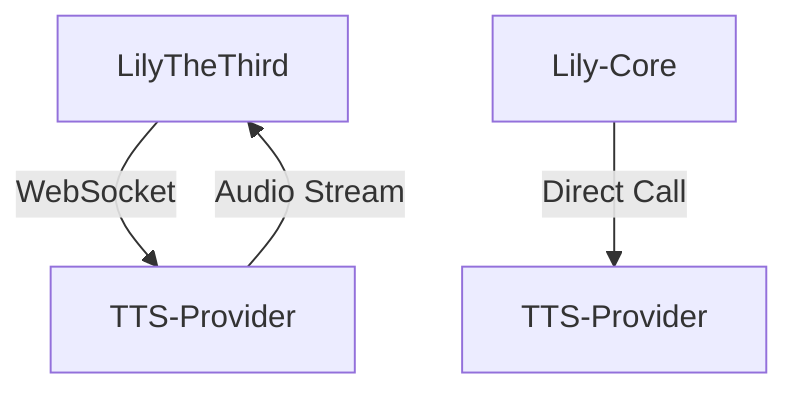
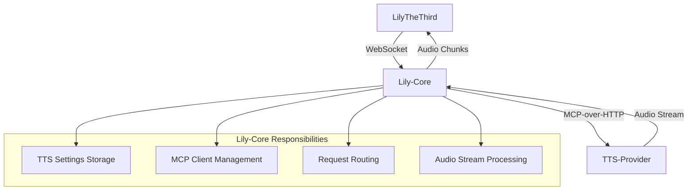
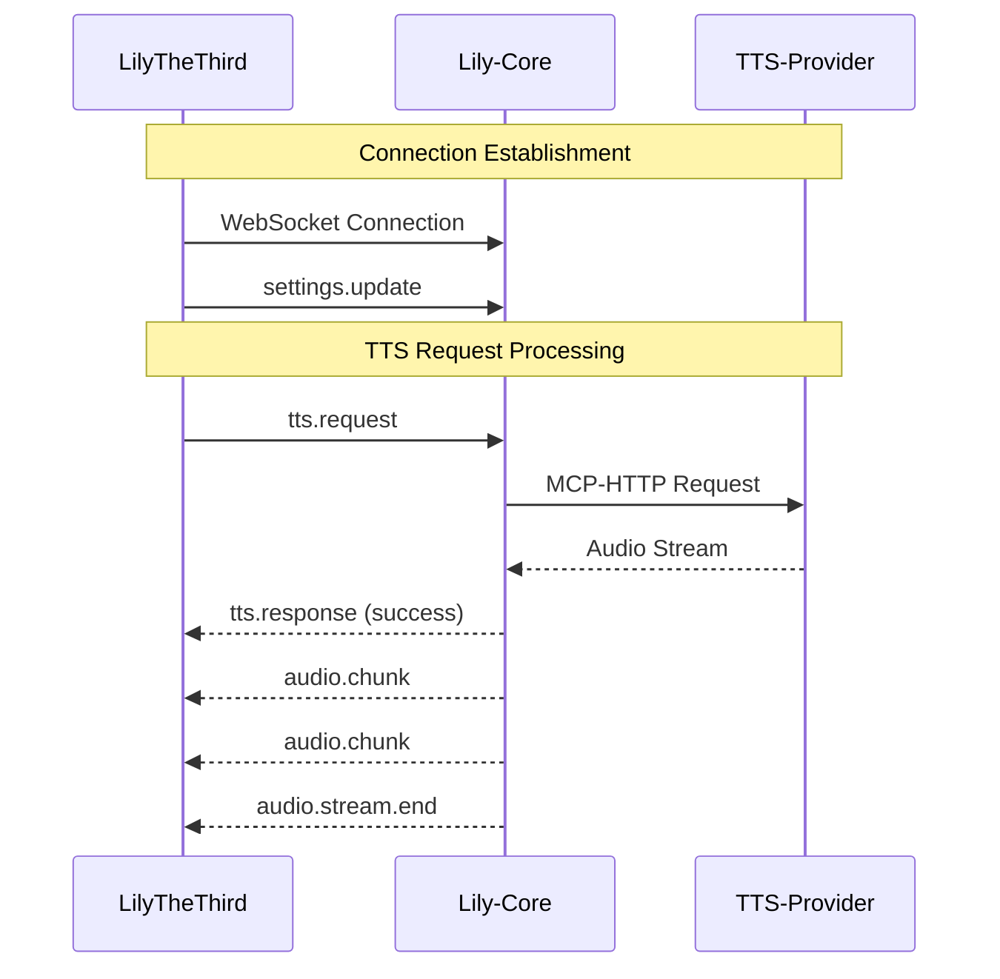

# TTS WebSocket Protocol Specification

This document outlines the WebSocket communication protocol between LilyTheThird and Lily-Core for Text-to-Speech (TTS) management.

## 1. Message Types

The communication is based on a single JSON message format with a `type` field to distinguish between different actions.

| Type                  | Sender        | Receiver      | Description                               |
| --------------------- | ------------- | ------------- | ----------------------------------------- |
| `settings.update`     | LilyTheThird  | Lily-Core     | Updates the TTS settings for the session. |
| `tts.request`         | LilyTheThird  | Lily-Core     | Requests speech generation for a prompt.  |
| `tts.response`        | Lily-Core     | LilyTheThird  | Sends back TTS status or error info.      |
| `audio.chunk`         | Lily-Core     | LilyTheThird  | Streams a chunk of audio data.            |
| `audio.stream.end`    | Lily-Core     | LilyTheThird  | Signals the end of the audio stream.      |
| `error`               | Lily-Core     | LilyTheThird  | Reports a critical error.                 |

## 2. Message Schemas

### 2.1 `settings.update`

Sent by LilyTheThird to configure the TTS settings for the current WebSocket session. Lily-Core stores these settings in memory.

```json
{
  "type": "settings.update",
  "payload": {
    "speaker": 1,
    "sample_rate": 24000,
    "model": "edge",
    "lang": "ja-JP"
  }
}
```

### 2.2 `tts.request`

Sent by LilyTheThird to request speech synthesis for a given text prompt.

```json
{
  "type": "tts.request",
  "payload": {
    "text": "こんにちは、これはテストです。"
  }
}
```

### 2.3 `tts.response`

Sent by Lily-Core to acknowledge the request and provide status updates.

```json
{
  "type": "tts.response",
  "payload": {
    "status": "success",
    "message": "TTS generation started.",
    "sample_rate": 24000,
    "channels": 1,
    "bit_depth": 16
  }
}
```

**Status values:**
- `success`: The request was accepted and processing has started.
- `queued`: The request is queued.
- `error`: An error occurred.

### 2.4 `audio.chunk`

A binary message containing a chunk of the generated audio. This message is sent directly after the `tts.response` with `status: "success"`.

### 2.5 `audio.stream.end`

Sent by Lily-Core to signal that all audio chunks have been sent.

```json
{
  "type": "audio.stream.end"
}
```

### 2.6 `error`

Sent by Lily-Core when a critical error occurs that prevents further processing.

```json
{
  "type": "error",
  "payload": {
    "code": 500,
    "message": "TTS Provider connection failed."
  }
}
## 3. Connection Lifecycle

### 3.1 Connection Establishment

1.  **LilyTheThird** initiates a WebSocket connection to `ws://lily-core-address/tts`.
2.  Upon successful connection, **Lily-Core** prepares to receive messages.
3.  **LilyTheThird** sends a `settings.update` message to configure the TTS parameters for the session.

### 3.2 Connection Status

- The connection is maintained as long as both client and server are running.
- **Lily-Core** will handle periodic pings to keep the connection alive if necessary.

### 3.3 Connection Closure

- **LilyTheThird** can close the connection at any time.
- **Lily-Core** will close the connection if a critical error occurs or if the client disconnects.
## 4. Error Handling and Recovery

### 4.1 Error Types

| Error Code | Description | Recovery Action |
| ---------- | ----------- | --------------- |
| 400 | Invalid message format | Client should check and resend valid message |
| 401 | Unauthorized access | Client should authenticate or reconnect |
| 500 | Internal server error | Server will send `error` message, client should retry or alert user |
| 503 | TTS Provider unavailable | Server will retry connection, notify client via `error` message |

### 4.2 Connection Recovery

1. If the WebSocket connection is lost, **LilyTheThird** should:
   - Attempt to reconnect with exponential backoff (1s, 2s, 4s, 8s, max 30s)
   - Send `settings.update` message upon reconnection
   - Resume operation as normal

2. If **Lily-Core** encounters an error:
   - Send an `error` message to the client
   - Attempt to recover internally if possible
   - Close the connection if recovery is not possible
## 5. Settings Synchronization Mechanism

### 5.1 Initialization

1. **LilyTheThird** connects to **Lily-Core** WebSocket endpoint
2.立即 after connection establishment, **LilyTheThird** sends a `settings.update` message
3. **Lily-Core** stores these settings in memory for the duration of the session
4. **Lily-Core** confirms receipt by sending an acknowledgment (optional)

### 5.2 Settings Storage

- Settings are stored per WebSocket connection
- Includes TTS parameters: speaker, sample_rate, model, lang
- Settings persist for the session duration only
- No persistent storage is maintained across sessions

### 5.3 Settings Changes

1. **LilyTheThird** sends new `settings.update` message
2. **Lily-Core** updates in-memory settings
3. Subsequent `tts.request` messages use the updated settings
## 6. Prompt Processing Workflow

### 6.1 Workflow Overview

1. **LilyTheThird** sends a `tts.request` message with the text to be synthesized
2. **Lily-Core** receives the request and validates it
3. **Lily-Core** retrieves stored TTS settings for the connection
4. **Lily-Core** initiates MCP-over-HTTP request to TTS-Provider with combined data
5. **Lily-Core** processes TTS-Provider response and begins audio streaming

### 6.2 Message Sequence

```
LilyTheThird             Lily-Core             TTS-Provider
     |                       |                       |
     |--- tts.request ------->|                       |
     |                       |--- MCP-HTTP ---------->|
     |                       |                       |
     |                       |<-- audio stream -------|
     |<-- tts.response -------|                       |
     |<-- audio.chunk --------|                       |
     |<-- audio.chunk --------|                       |
     |<-- audio.stream.end ---|                       |
```

### 6.3 Text Translation

Text processing follows the same pattern as the current implementation:
1. Translate text to Japanese using `translator.py`
2. Send translated text to TTS-Provider
3. Handle translation failures gracefully
## 7. Audio Streaming Process

### 7.1 Streaming Architecture

The audio streaming follows a chunked approach to handle varying network conditions:

1. **Lily-Core** receives audio stream from TTS-Provider via MCP-over-HTTP
2. **Lily-Core** buffers and chunks the audio data
3. **Lily-Core** sends audio chunks as WebSocket binary messages to **LilyTheThird**
4. **LilyTheThird** reconstructs and plays the audio stream

### 7.2 Audio Chunk Format

- **Message Type**: `audio.chunk` (binary message, no JSON wrapper)
- **Chunk Size**: Variable, determined by network conditions (recommended: 4096-8192 bytes)
- **Format**: Raw PCM audio data (16-bit or 32-bit depending on bit_depth setting)

### 7.3 Audio Playback on Client Side

**LilyTheThird** implements the same audio playback logic as the current direct TTS implementation:

1. Collect audio chunks in a buffer
2. After receiving `audio.stream.end`, convert buffer to numpy array
3. Apply audio format settings (sample_rate, channels, bit_depth)
4. Play audio using sounddevice library
5. Handle edge cases (partial audio, format errors)

### 7.4 Stream Termination

- **Normal Termination**: **Lily-Core** sends `audio.stream.end` after all audio chunks
- **Error Termination**: If TTS-Provider stream fails, **Lily-Core** sends `error` message
- **Connection Loss**: **Lily-Core** attempts to notify client before closing WebSocket
## 8. Architecture Diagram

### 8.1 Current Architecture (Direct Connection)



### 8.2 Proposed Architecture (Centralized Management)



### 8.3 Message Flow Sequence


